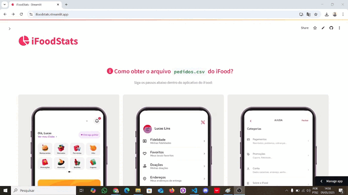

# 📊 iFoodStats

**Visualize e analise seus gastos com o iFood de forma clara, rápida e interativa.**  
Basta enviar seu arquivo `pedidos.csv` e o app gera automaticamente métricas, gráficos e uma tabela com seus pedidos concluídos.

---

## 🔗 Acesse agora

👉 [Abrir o app no navegador](https://ifoodstats.streamlit.app)

---

## 🧾 O que o app mostra

- Total gasto
- Número de pedidos
- Ticket médio
- Pedido mais caro e mais barato (com restaurante)
- Gráfico dos 10 restaurantes que você mais gastou
- Gastos por:
  - Ano
  - Mês
  - Dia da semana
- Tabela com todos os pedidos

---

## 📂 Como obter seu `pedidos.csv`

1. No app do iFood, vá em **Ajuda**.
2. Toque em **Privacidade e dados**.
3. Selecione **Quero uma cópia dos meus dados**.
4. Clique em **Solicitar cópia**.
5. Após algumas horas, você receberá um arquivo `.zip`. Descompacte e envie apenas o arquivo `pedidos.csv`.

> 🔒 Nenhuma informação é armazenada. Os dados são processados localmente no seu navegador.

---

## 📦 Instalação local (opcional)

```bash
git clone https://github.com/lucaslins21/ifood-dashboard-app.git
cd ifood-dashboard-app
pip install -r requirements.txt
streamlit run streamlit_app.py
```

---

## 📸 Preview



---

## 🚀 Tecnologias usadas

- [Streamlit](https://streamlit.io/)
- [Pandas](https://pandas.pydata.org/)
- [Plotly](https://plotly.com/python/)
